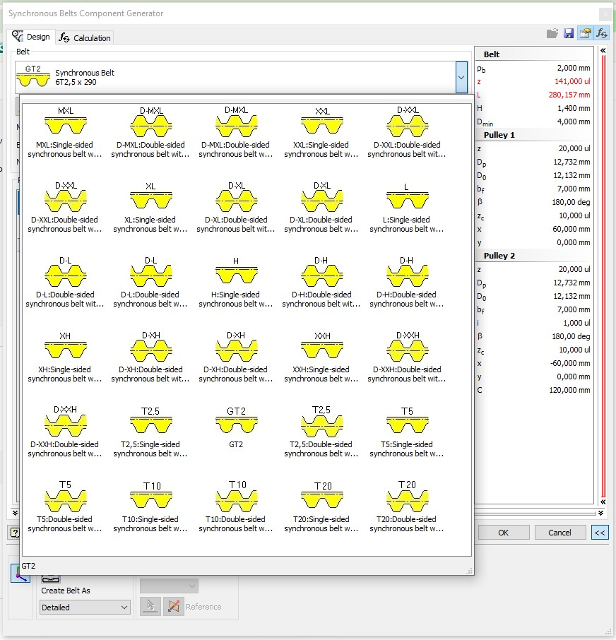
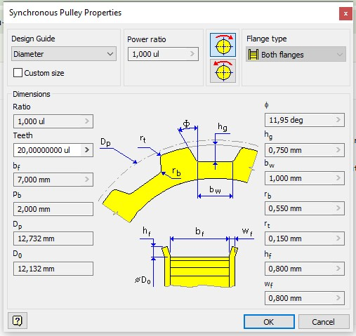
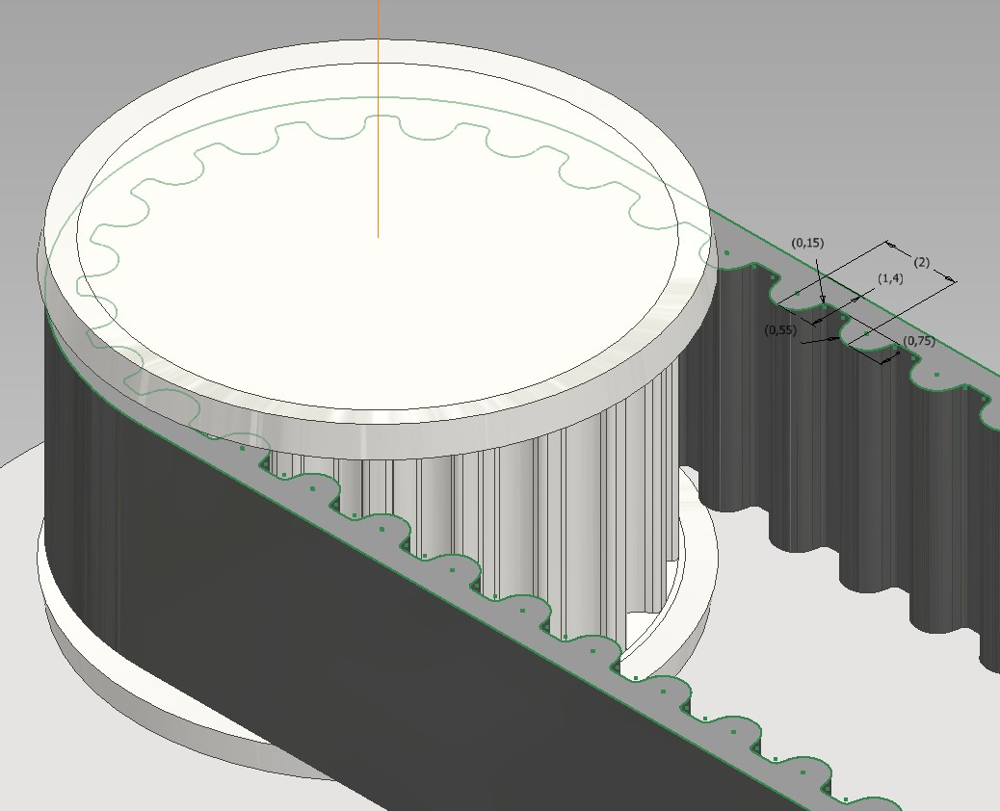

# GT2 Belts and Pulleys for Autodesk Inventor

This repository adds GT2 timing belts and pulleys to Autodesk Inventor Design Accelerator.

I created these files because Inventor does not include a native GT2 library, and configuring a new belt profile manually requires editing several XML files with very little documentation available.

The package includes:

* GT2 belt profile (2 mm pitch)
* GT2 pulley profile
* Flanged and non-flanged pulleys
* Custom tooth counts
* Design Accelerator integration

## Tested on

* Autodesk Inventor 2020

Other versions may work but have not been tested.

## Installation

1. Close Autodesk Inventor.

2. Backup your existing Design Accelerator files.

3. Download the latest release ZIP file.

4. Extract the ZIP contents.

The archive contains a pre-built `Design Accelerator` directory structure:

```text
Design Accelerator
├── SBelts.xml
├── Belts
│   └── GT2.xml
├── Pulleys
│   ├── GT2.xml
│   ├── GT2-FB.xml
│   ├── GT2-FL.xml
│   └── GT2-FR.xml
└── ...
```

5. Copy the included `Design Accelerator` folder into your Inventor `Design Data` directory.

Typical location:

```text
C:\Users\Public\Documents\Autodesk\Inventor XXXX\Design Data
```

6. Allow Windows to merge folders and overwrite existing files when prompted.

7. Start Inventor.

The GT2 belt and pulley families should now appear in Design Accelerator.

## Current Status

Working:

* GT2 belts
* GT2 pulleys
* Custom tooth counts
* Flanged pulley variants
* Corrected pulley width definitions (bf values)

Known issue:

* The generated pulley pitch and outer diameters do not yet perfectly match published GT2 pulley dimensions from commercial manufacturers.
* The deviation is small and the library is fully functional, but the source of the remaining diameter discrepancy inside Inventor's pulley generator has not yet been identified.
* Contributions and investigations are welcome.

## Notes

These files were created by reverse-engineering Autodesk's existing timing belt libraries and adapting them for GT2 geometry.

Always verify critical dimensions before manufacturing parts.

## Why this repository exists

Because there should be an easier way to use GT2 belts in Inventor.

If these files save you several hours of XML editing, then the project achieved its goal.

## Example

## Belt Selection



## Generated 20T Pulley



## Assembly


